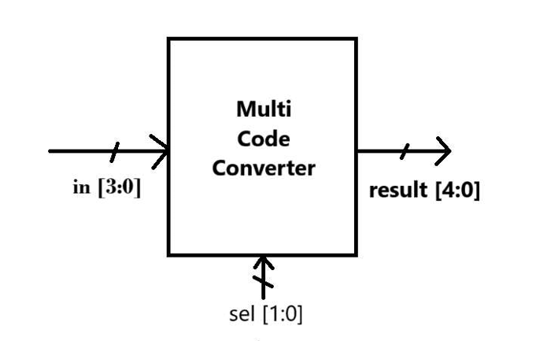

# Multi Code Converter (Verilog)
## Overview

 The main aim of this project is to implement a 4-bit Multi Code Converter in verilog HDL. The 4-bit Multi Code Converter takes a 4-bit binary data from input port along with a 2-bit selector port. The 2-bit selector is used for choosing between the different types of codes that are to be generated at the output ports i.e. BCD, Gray code and Excess-3. This project does not use clock signal and it based purely on combinational logic.

## Key Features

Converts 4-bit binary input into multiple code formats

Supports BCD, Gray code, and Excess-3 conversion

Uses a 2-bit selector to choose output type

Fully combinational design (no sequential logic)

Separate logic blocks for each conversion

Simple and beginner-friendly Verilog implementation

Easy to extend with additional code formats
Inputs and Output

in [3:0] – 4-bit binary input

sel [1:0] – Select signal to choose conversion type

result [4:0] – 5-bit converted output

## Conversion Details

BCD conversion implemented using a case statement lookup

Gray code generated using XOR operations between adjacent bits

Excess-3 code generated by adding decimal 3 to input value

Default output is zero for undefined selector values

## Block Diagram

## Learning Outcomes

Understanding of code conversion techniques

Practice with combinational always blocks

Use of parameters in Verilog

Implementation of case statements and bitwise operations

Clear separation of logic blocks for modular design

